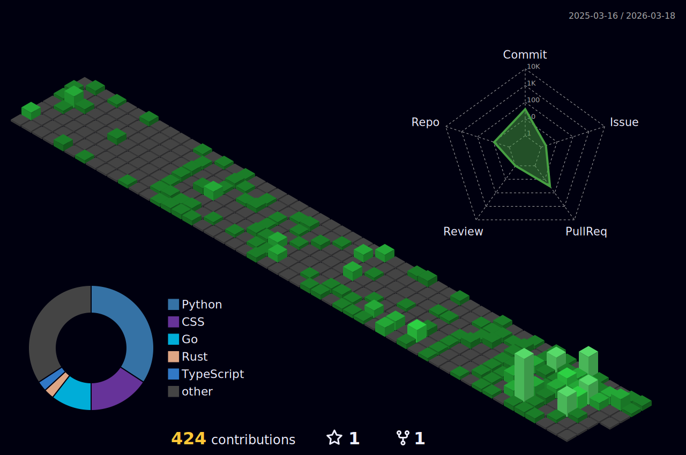

# Hi, I'm Ishan Singh 👋

## About Me

I'm a passionate developer with a focus on Defi,AI and distributed systems. I love creating amazing experiences with code that have a.

- 🚀 Philospohy of Engineering is deeper than anyone expects.
- 🌱 Learning and exploring new technologies.
- 👯 Looking to collaborate on projects and innovative ideas.
- 💬 Ask me about software development, blockchain  and LLMs.
- 📫 How to reach me: [LinkedIn](https://www.linkedin.com/in/ishan-singh-xrdev/) | [Gmail](ishansingh2609@gmail.com)

## Tech Stacks

Here are some technologies I work with:

### Blog posts
<!-- BLOG-POST-LIST:START -->
- [How to implement place objects on plane in unity with arcore for android](https://medium.com/@i_singh/how-to-implement-place-objects-on-plane-in-unity-with-arcore-for-android-3c6c3d617ce0)
<!-- BLOG-POST-LIST:END -->

&nbsp;

Let's innovate and create amazing experiences together! 🚀

# Featured Contributions
* [https://github.com/sonirico/go-hyperliquid PR#115 ](https://github.com/sonirico/go-hyperliquid/pull/115)
* [https://github.com/sonirico/go-hyperliquid PR#128 ](https://github.com/sonirico/go-hyperliquid/pull/128)

